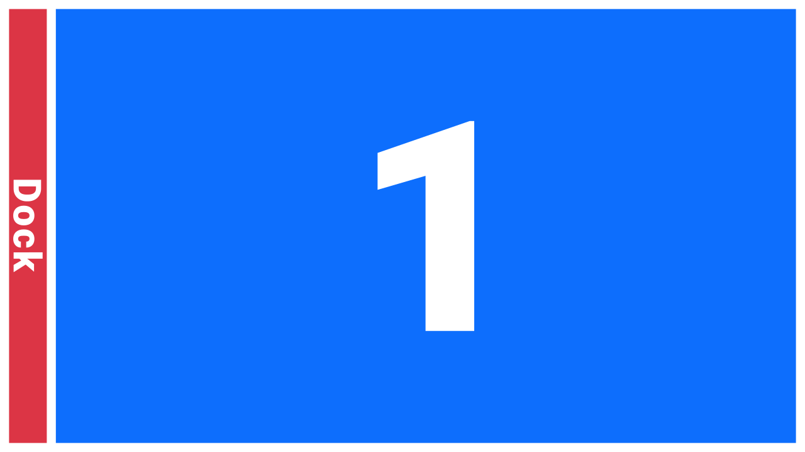

# PunkWM
<details>
  <summary style="font-size: 20px; font-weight: bold;">Feature</summary>


</details>

<details>
  <summary style="font-size: 20px; font-weight: bold;">Installation</summary>


</details>

<details>
  <summary style="font-size: 20px; font-weight: bold;">Keyboard Shortcuts</summary>

  | Function | Description | Default Shortcut |
  |:-----------|:------------|:------------------:|
  | Workspace:1 | This function changes the current workspace to Workspace 1. | <kbd>SUPER</kbd> + <kbd>1</kbd>  |
  | Workspace:2 | This function changes the current workspace to Workspace 2. | <kbd>SUPER</kbd> + <kbd>2</kbd>  |
  | Workspace:3 | This function changes the current workspace to Workspace 3. | <kbd>SUPER</kbd> + <kbd>3</kbd>  |
  | Workspace:4 | This function changes the current workspace to Workspace 4. | <kbd>SUPER</kbd> + <kbd>4</kbd>  |
  | Workspace:5 | This function changes the current workspace to Workspace 5. | <kbd>SUPER</kbd> + <kbd>5</kbd>  |
  | Workspace:6 | This function changes the current workspace to Workspace 6. | <kbd>SUPER</kbd> + <kbd>6</kbd>  |
  | Workspace:7 | This function changes the current workspace to Workspace 7. | <kbd>SUPER</kbd> + <kbd>7</kbd>  |
  | Workspace:8 | This function changes the current workspace to Workspace 8. | <kbd>SUPER</kbd> + <kbd>8</kbd>  |
  | Workspace:9 | This function changes the current workspace to Workspace 9. | <kbd>SUPER</kbd> + <kbd>9</kbd>  |
  | Focus:To:Workspace:1 | This function moves the currently focused window to Workspace 1 and changes the active workspace to Workspace 1. | <kbd>SUPER</kbd> + <kbd>SHIFT</kbd> + <kbd>1</kbd>  |
  | Focus:To:Workspace:2 | This function moves the currently focused window to Workspace 2 and changes the active workspace to Workspace 2. | <kbd>SUPER</kbd> + <kbd>SHIFT</kbd> + <kbd>2</kbd>  |
  | Focus:To:Workspace:3 | This function moves the currently focused window to Workspace 3 and changes the active workspace to Workspace 3. | <kbd>SUPER</kbd> + <kbd>SHIFT</kbd> + <kbd>3</kbd>  |
  | Focus:To:Workspace:4 | This function moves the currently focused window to Workspace 4 and changes the active workspace to Workspace 4. | <kbd>SUPER</kbd> + <kbd>SHIFT</kbd> + <kbd>4</kbd>  |
  | Focus:To:Workspace:5 | This function moves the currently focused window to Workspace 5 and changes the active workspace to Workspace 5. | <kbd>SUPER</kbd> + <kbd>SHIFT</kbd> + <kbd>5</kbd>  |
  | Focus:To:Workspace:6 | This function moves the currently focused window to Workspace 6 and changes the active workspace to Workspace 6. | <kbd>SUPER</kbd> + <kbd>SHIFT</kbd> + <kbd>6</kbd>  |
  | Focus:To:Workspace:7 | This function moves the currently focused window to Workspace 7 and changes the active workspace to Workspace 7. | <kbd>SUPER</kbd> + <kbd>SHIFT</kbd> + <kbd>7</kbd>  |
  | Focus:To:Workspace:8 | This function moves the currently focused window to Workspace 8 and changes the active workspace to Workspace 8. | <kbd>SUPER</kbd> + <kbd>SHIFT</kbd> + <kbd>8</kbd>  |
  | Focus:To:Workspace:9 | This function moves the currently focused window to Workspace 9 and changes the active workspace to Workspace 9. | <kbd>SUPER</kbd> + <kbd>SHIFT</kbd> + <kbd>9</kbd>  |
  | Move:Focus:To:Workspace:1 | This function moves the currently focused window to Workspace 1 while keeping the current workspace active. | <kbd>ALT</kbd> + <kbd>SUPER</kbd> + <kbd>SHIFT</kbd> + <kbd>1</kbd>  |
  | Move:Focus:To:Workspace:2 | This function moves the currently focused window to Workspace 2 while keeping the current workspace active. | <kbd>ALT</kbd> + <kbd>SUPER</kbd> + <kbd>SHIFT</kbd> + <kbd>2</kbd>  |
  | Move:Focus:To:Workspace:3 | This function moves the currently focused window to Workspace 3 while keeping the current workspace active. | <kbd>ALT</kbd> + <kbd>SUPER</kbd> + <kbd>SHIFT</kbd> + <kbd>3</kbd>  |
  | Move:Focus:To:Workspace:4 | This function moves the currently focused window to Workspace 4 while keeping the current workspace active. | <kbd>ALT</kbd> + <kbd>SUPER</kbd> + <kbd>SHIFT</kbd> + <kbd>4</kbd>  |
  | Move:Focus:To:Workspace:5 | This function moves the currently focused window to Workspace 5 while keeping the current workspace active. | <kbd>ALT</kbd> + <kbd>SUPER</kbd> + <kbd>SHIFT</kbd> + <kbd>5</kbd>  |
  | Move:Focus:To:Workspace:6 | This function moves the currently focused window to Workspace 6 while keeping the current workspace active. | <kbd>ALT</kbd> + <kbd>SUPER</kbd> + <kbd>SHIFT</kbd> + <kbd>6</kbd>  |
  | Move:Focus:To:Workspace:7 | This function moves the currently focused window to Workspace 7 while keeping the current workspace active. | <kbd>ALT</kbd> + <kbd>SUPER</kbd> + <kbd>SHIFT</kbd> + <kbd>7</kbd>  |
  | Move:Focus:To:Workspace:8 | This function moves the currently focused window to Workspace 8 while keeping the current workspace active. | <kbd>ALT</kbd> + <kbd>SUPER</kbd> + <kbd>SHIFT</kbd> + <kbd>8</kbd>  |
  | Move:Focus:To:Workspace:9 | This function moves the currently focused window to Workspace 9 while keeping the current workspace active. | <kbd>ALT</kbd> + <kbd>SUPER</kbd> + <kbd>SHIFT</kbd> + <kbd>9</kbd>  |
  | Window:Focus:Next | This function changes focus to the next window. |  <kbd>ALT</kbd> + <kbd>J</kbd>  |
  | Window:Focus:Previous | This function changes focus to the previous window. |  <kbd>ALT</kbd> + <kbd>K</kbd>  |
  | Window:Closed:Focused | This function closes the currently focused window. |  <kbd>ALT</kbd> + <kbd>Q</kbd>  |
  | Layout:Toggle | This function changes the current workspace layout to the next layout.|  <kbd>ALT</kbd> + <kbd>L</kbd>  |
  | Open:<kbd>APP</kbd> | This function opens the APP application. |  |
  | Open:TERMINAL | This function opens the configured terminal.|  <kbd>SUPER</kbd> + <kbd>Return</kbd>  |
  | Open:BROWSER |This function opens the configured browser|  <kbd>SUPER</kbd> + <kbd>B</kbd>  |
  | Open:EDITOR |This function opens the configured editor|  <kbd>SUPER</kbd> + <kbd>E</kbd>  |
  | Open:FILEMANAGER |This function opens the configured file explorer|  <kbd>SUPER</kbd> + <kbd>L</kbd>  |
</details>


<details>
  <summary style="font-size: 20px; font-weight: bold;">Layouts</summary>

  | Pos | Name| Description | Wiew with 1 window |  Wiew with 2 window |  Wiew with 3 window | Wiew with 4 window | Wiew with 5 window |
  |:--:|:--:|:----------------|:---:|:----:|:---:|:---:|:--:|
  |11| Full Screen |Each window takes up the full screen without respecting margins. ||||||
  |14| Max |This layout makes each window occupy the entire screen while respecting the margins. ||||||
  


</details>


 


<!-- 


| Módulo               | Función                                                       |
| -------------------- | ------------------------------------------------------------- |
| **WM Core**          | Manejo de ventanas: **abrir**, **cerrar**, maximizar, mover, tiling   |
| **Layout Manager**   | **Definir layouts**: **tile**, **max**, **spiral**, **dwindle**, **magnifier**, **fair** |
| **Widget Manager**   | Controlar widgets HTML/CSS y su comunicación con Core         |
| **Input Handler**    | Mapear teclas, atajos (ej. Alt+Q, SUPER+... )                 |
| **Persistence**      | Guardar layouts y posición de widgets en `persistence.bin`    |
| **IPC / Messaging**  | Comunicación Core ↔ Widgets (WebSocket / JSON / IPC)          |
| **Rendering Engine** | WebView o motor HTML/CSS para render de widgets               |
| **Event Loop**       | Captura eventos X11/Wayland y los distribuye a Core y Widgets |


## 🔧 Requisitos por GPU

### 🟩 NVIDIA

* GPU NVIDIA
* Drivers propietarios instalados
* Herramienta incluida con el driver:

  * `nvidia-smi`

Verificación:

```bash
command -v nvidia-smi
```

---

### 🟦 Intel (iGPU)

* GPU Intel integrada
* Kernel con soporte i915
* Paquete:

  ```bash
  intel-gpu-tools
  ```
* Dependencia adicional:

  ```bash
  jq
  ```

Instalación:

```bash
sudo apt install intel-gpu-tools jq
```

Verificación:

```bash
command -v intel_gpu_top
```

---

### 🟥 AMD

* GPU AMD (amdgpu)
* Paquete:

  ```bash
  radeontop
  ```

Instalación:

```bash
sudo apt install radeontop
```

Verificación:

```bash
command -v radeontop
```

---

## 🧪 Salida

* Devuelve **un número**
* Sin `%`
* Ejemplo:

```text
42
```

---

## ⚠️ Notas

* No funciona en sistemas sin GPU
* Requiere permisos normales de usuario
* Compatible con **X11 y Wayland**
* Ideal para scripts, Rust, paneles y dashboards

---

## 💡 Tip

Para asegurar siempre una salida numérica:

```bash
( comando ) || echo 0
```

---

Si querés, te armo también:

* un README completo para **CPU + RAM + DISCO + GPU**
* o una versión **sin jq** para Intel

Decime 😎
¡Perfecto! Te voy a dar un **tutorial paso a paso para obtener `credentials.json`** listo para poner en tu README. Lo voy a escribir de forma clara, como para que cualquiera lo siga.

---

# Cómo obtener `credentials.json` para Google Calendar API

Para usar la **Google Calendar API** en tu proyecto Rust (o cualquier lenguaje), necesitas un archivo `credentials.json` que contenga tus credenciales de OAuth 2.0. Este archivo permite que tu aplicación acceda a la API en nombre de un usuario.

---

## 1️⃣ Crear un proyecto en Google Cloud

1. Ve a [Google Cloud Console](https://console.cloud.google.com/).
2. Haz clic en **Seleccionar proyecto → Nuevo proyecto**.
3. Escribe un nombre para tu proyecto y haz clic en **Crear**.
4. Espera unos segundos hasta que el proyecto se haya creado.

---

## 2️⃣ Activar la API de Google Calendar

1. Con tu proyecto seleccionado, ve a **APIs y servicios → Biblioteca**.
2. Busca **Google Calendar API**.
3. Haz clic en **Habilitar**.

---

## 3️⃣ Crear credenciales OAuth 2.0

1. Ve a **APIs y servicios → Credenciales**.
2. Haz clic en **+ Crear credenciales → ID de cliente OAuth**.
3. Si es la primera vez, te pedirá configurar **Pantalla de consentimiento**:

   * Nombre de la aplicación: `Mi App Rust` (o lo que quieras)
   * Correo de soporte: tu correo
   * Guarda los cambios
4. Tipo de aplicación: **Aplicación de escritorio**
5. Nombre: `Mi App Rust Desktop`
6. Haz clic en **Crear**.
7. Descarga el archivo JSON haciendo clic en **Descargar JSON**.

> Este archivo es tu `credentials.json`.

---
 -->
